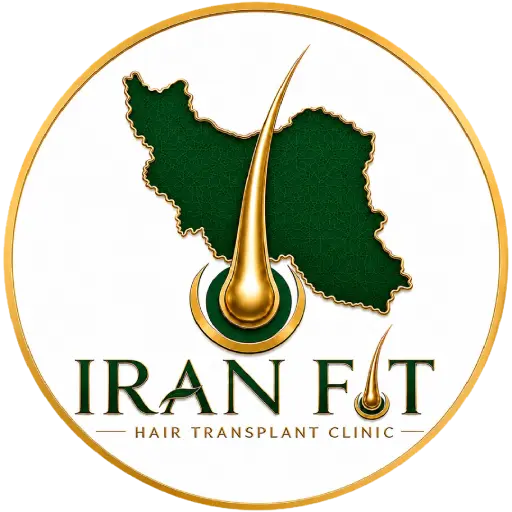

# معرفی و آشنایی با دانشنامه کاشت مو ایران فیت

دانشنامه کاشت مو ایران فیت یک ویکی فارسی برای آشنایی دقیق‌تر با ریزش مو، روش‌های کاشت، مراقبت‌ها و تصمیم‌گیری آگاهانه قبل از درمان است.

🔗 ورود به دانشنامه:  
https://github.com/iranfit/hairtransplant/wiki

---

## این دانشنامه به چه درد شما می‌خورد؟

اگر در حال بررسی کاشت مو هستید، این دانشنامه کمک می‌کند:

- مفاهیم اصلی را ساده و دقیق یاد بگیرید
- تفاوت روش‌های کاشت مو را بهتر بفهمید
- بدانید قبل و بعد از عمل باید به چه نکاتی توجه کنید
- عوارض احتمالی و ریسک‌ها را واقع‌بینانه بشناسید
- برای انتخاب پزشک و کلینیک تصمیم آگاهانه‌تری بگیرید
- با دید بازتری هزینه‌ها را مقایسه کنید

---

## از کجا شروع کنم؟

برای شروع، این مسیر پیشنهاد می‌شود:

1. [شروع از اینجا](https://github.com/iranfit/hairtransplant/wiki/%D8%B4%D8%B1%D9%88%D8%B9-%D8%A7%D8%B2-%D8%A7%DB%8C%D9%86%D8%AC%D8%A7)
2. [نقشه دانشنامه](https://github.com/iranfit/hairtransplant/wiki/%D9%86%D9%82%D8%B4%D9%87-%D8%AF%D8%A7%D9%86%D8%B4%D9%86%D8%A7%D9%85%D9%87)
3. [کاشت مو چیست](https://github.com/iranfit/hairtransplant/wiki/%DA%A9%D8%A7%D8%B4%D8%AA-%D9%85%D9%88-%DA%86%DB%8C%D8%B3%D8%AA)
4. [ریزش مو: علل و تشخیص](https://github.com/iranfit/hairtransplant/wiki/%D8%B1%DB%8C%D8%B2%D8%B4-%D9%85%D9%88-%D8%B9%D9%84%D9%84-%D9%88-%D8%AA%D8%B4%D8%AE%DB%8C%D8%B5)
5. [روش اف آی تی](https://github.com/iranfit/hairtransplant/wiki/%D8%B1%D9%88%D8%B4-%D8%A7%D9%81-%D8%A2%DB%8C-%D8%AA%DB%8C)
6. [مقایسه کامل روش‌های کاشت مو](https://github.com/iranfit/hairtransplant/wiki/%D9%85%D9%82%D8%A7%DB%8C%D8%B3%D9%87-%DA%A9%D8%A7%D9%85%D9%84-%D8%B1%D9%88%D8%B4-%D9%87%D8%A7%DB%8C-%DA%A9%D8%A7%D8%B4%D8%AA-%D9%85%D9%88)
7. [چک‌لیست قبل از عمل](https://github.com/iranfit/hairtransplant/wiki/%DA%86%DA%A9-%D9%84%DB%8C%D8%B3%D8%AA-%D9%82%D8%A8%D9%84-%D8%A7%D8%B2-%D8%B9%D9%85%D9%84)
8. [برنامه مراقبت پس از کاشت](https://github.com/iranfit/hairtransplant/wiki/%D8%A8%D8%B1%D9%86%D8%A7%D9%85%D9%87-%D8%B2%D9%85%D8%A7%D9%86%DB%8C-%DA%A9%D8%A7%D9%85%D9%84-%D9%85%D8%B1%D8%A7%D9%82%D8%A8%D8%AA-%D9%BE%D8%B3-%D8%A7%D8%B2-%DA%A9%D8%A7%D8%B4%D8%AA)
9. [عوارض شایع](https://github.com/iranfit/hairtransplant/wiki/%D8%B9%D9%88%D8%A7%D8%B1%D8%B6-%D8%B4%D8%A7%DB%8C%D8%B9)
10. [چک‌لیست انتخاب پزشک و کلینیک](https://github.com/iranfit/hairtransplant/wiki/%DA%86%DA%A9-%D9%84%DB%8C%D8%B3%D8%AA-%D8%A7%D9%86%D8%AA%D8%AE%D8%A7%D8%A8-%D9%BE%D8%B2%D8%B4%DA%A9-%D9%88-%DA%A9%D9%84%DB%8C%D9%86%DB%8C%DA%A9)
11. [راهنمای هزینه کاشت مو در ایران](https://github.com/iranfit/hairtransplant/wiki/%D8%B1%D8%A7%D9%87%D9%86%D9%85%D8%A7%DB%8C-%DA%A9%D8%A7%D9%85%D9%84-%D9%87%D8%B2%DB%8C%D9%86%D9%87-%DA%A9%D8%A7%D8%B4%D8%AA-%D9%85%D9%88-%D8%AF%D8%B1-%D8%A7%DB%8C%D8%B1%D8%A7%D9%86)

---

## داخل دانشنامه چه موضوعاتی را می‌بینید؟

- مفاهیم پایه کاشت مو
- بررسی علل ریزش مو و مسیر تشخیص
- معرفی و مقایسه روش‌های کاشت (با تمرکز محتوایی بر FIT)
- آمادگی‌های قبل از عمل
- مراقبت‌های بعد از عمل
- عوارض و ریسک‌های احتمالی
- نکات انتخاب پزشک و کلینیک
- راهنمای هزینه

---

  

## مشاوره تخصصی در کلینیک ایران فیت

اگر نیاز به مشاوره و ارزیابی تخصصی پزشکی دارید، می‌توانید با کلینیک ایران فیت تماس بگیرید:

- **تلفن تماس:** [02122223030](tel:+982122223030)
- **مشاوره:** [09128883848](tel:+989128883848)
- **وب‌سایت:** [iranfit.net](https://iranfit.net/)
- **اینستاگرام:** [instagram.com/iranfit.net](https://instagram.com/iranfit.net)
- **کانال بله:** [ble.ir/iranfitclinic](https://ble.ir/iranfitclinic)
- **آدرس:** تهران، خیابان شریعتی، دوراهی قلهک، کوچه مرشدی، پلاک ۷ و ۹
- **مجوز بهره‌برداری:** 298183 - 3

📌 **رزرو نوبت و دریافت مشاوره:**  
[https://iranfit.net](https://iranfit.net/)

---

## منابع علمی

در مقاله‌های تکمیل‌شده، بخش «منابع و وضعیت بازبینی» قرار می‌گیرد و منابع معتبر (مثل PubMed/PMC) لینک می‌شوند تا امکان بررسی بیشتر برای خواننده فراهم باشد.

---

## نکته مهم پزشکی

محتوای این دانشنامه آموزشی است و جایگزین معاینه، تشخیص یا توصیه اختصاصی پزشک نیست.  
برای تصمیم نهایی درمان، حتماً با پزشک متخصص مشورت کنید.

---

## وضعیت حقوقی محتوا

© 2026 Iran Fit. All rights reserved.

استفاده یا بازنشر کامل محتوا بدون مجوز کتبی مجاز نیست.  
برای جزئیات بیشتر، فایل [LICENSE](./LICENSE) را ببینید.

